# 📚 Internal Documentation Repository

## Mục tiêu
Repo này lưu trữ toàn bộ **tài liệu kỹ thuật nội bộ** của dự án (.NET 8 + Orleans + EF Core + SQL Server + RabbitMQ + Redis).  
Mục đích chính:
- Truyền đạt **kiến trúc & quyết định thiết kế** (ADR).  
- Hướng dẫn **phát triển, vận hành, onboarding**.  
- Ghi lại **lịch sử releases, roadmap**.  
- Đảm bảo tri thức được **truyền thừa** cho team hiện tại và thế hệ sau.  

---

## 🗂️ Cấu trúc thư mục

### 1. [ADR](./adr/README.md) (Architecture Decision Records)
- Ghi lại **các quyết định kiến trúc quan trọng**.  
- Ví dụ: [0001-use-rabbitMQ.md](./adr/0001-use-rabbitMQ.md), [0003-outbox-pattern.md](./adr/0003-outbox-pattern.md).  
- Giúp hiểu **tại sao** chọn công nghệ/giải pháp, không chỉ “làm thế nào”.

### 2. [Architecture](./architecture.md) & [System Overview](./system-overview.md)
- Mô tả **kiến trúc tổng thể** (API, Orleans, DB, Redis, RabbitMQ, CI/CD).  
- Bao gồm sơ đồ high-level, data flow, trade-offs.

### 3. [Features](./features/README.md)
- Tài liệu **feature spec**: business context, requirements, API contract, flow diagram, data model.  
- Có template sẵn: [000-template.md](./features/000-template.md).  
- Ví dụ: [auth-login.md](./features/auth-login.md), [order-placement.md](./features/order-placement.md).

### 4. [Onboarding](./onboarding/README.md)
- Hướng dẫn dev mới setup local, workflow Git, CI/CD, checklist.  
- Giúp dev mới chạy được hệ thống trong 1 ngày.  
- Có [FAQ](./onboarding/faq.md) cho lỗi thường gặp.

### 5. [Testing](./testing/README.md)
- Chiến lược test (Unit, Integration, Performance, E2E).  
- Quy định rõ cách viết test với xUnit, Orleans TestCluster, Testcontainers.  
- Performance test bằng JMeter/k6.  
- PR nào cũng phải tick checklist test.

### 6. [Conventions](./conventions/README.md)
- Chuẩn hóa code style, API guidelines, branching strategy, commit conventions.  
- Có [review-checklist.md](./conventions/review-checklist.md) giúp reviewer dễ tick khi duyệt PR.  

### 7. [Dependencies](./dependencies/README.md)
- Liệt kê các phụ thuộc:
  - [external-apis.md](./dependencies/external-apis.md) – API bên ngoài.  
  - [rabbitmq-queues.md](./dependencies/rabbitmq-queues.md) – Queue/Exchange.  
  - [redis-keys.md](./dependencies/redis-keys.md) – Redis key pattern.  

### 8. [Observability](./observability/README.md)
- Logging (Serilog, JSON, traceId).  
- Tracing (OpenTelemetry, distributed trace).  
- Metrics (Prometheus, Grafana dashboards).  
- Liên kết với [Runbooks](./ops/runbooks/) để xử lý sự cố.  

### 9. [Ops](./ops/README.md)
- **SOPs** (Standard Operating Procedures): quy trình chuẩn (deploy, monitoring, backup).  
- **Runbooks**: xử lý sự cố cụ thể (API down, RabbitMQ backpressure, SQL deadlock, Orleans silo fail).  

### 10. [Releases](./releases/README.md)
- Lịch sử phát hành (changelog, release notes).  
- Semantic versioning.  
- Template release: [release-template.md](./releases/release-template.md).  

### 11. [Roadmap](./roadmap.md)
- Định hướng phát triển theo quý.  
- Liên kết feature, ADR, release.  
- Định hướng dài hạn cho business + tech.  

### 12. [Assets](./assets/README.md)
- Lưu hình ảnh, sơ đồ, mockups, icons hỗ trợ tài liệu.  
- Có subfolder: `architecture/`, `data-model/`, `features/`, `screenshots/`, `icons/`.

### 13. [Glossary](./glossary.md)
- Giải thích các thuật ngữ domain: Order, Execution, LP, Grain, Saga, Idempotency…

---

## 🔗 Liên kết quan trọng
- **ADR Index:** [adr/README.md](./adr/README.md)  
- **Feature Template:** [features/000-template.md](./features/000-template.md)  
- **PR Checklist:** [conventions/review-checklist.md](./conventions/review-checklist.md)  
- **Runbooks:** [ops/runbooks/](./ops/runbooks/)  
- **Changelog:** [releases/changelog.md](./releases/changelog.md)  

---

## 🌍 Best Practices áp dụng
- **Doc-as-code** (Markdown trong repo, version control bằng Git).  
- **Traceability**: mỗi Feature ↔ ADR ↔ Release ↔ Runbook liên kết với nhau.  
- **Transparency**: mọi quyết định quan trọng đều có ADR.  
- **Consistency**: conventions thống nhất từ code → docs → ops.  

---

## 📌 Cách dùng
- Dev mới: đọc [Onboarding](./onboarding/README.md) + [Features](./features/README.md).  
- Reviewer: dùng [Review Checklist](./conventions/review-checklist.md).  
- Ops: theo [SOPs](./ops/sop/) và [Runbooks](./ops/runbooks/).  
- SA/Tech Lead: tham khảo [Architecture](./architecture.md), [ADR](./adr/README.md), [Roadmap](./roadmap.md).  

---
## 🗺️ Docs Map (Mermaid)

```mermaid
flowchart TD
    A[docs/]:::root --> A1[adr/]:::sec
    A --> A2[architecture.md]:::leaf
    A --> A3[system-overview.md]:::leaf
    A --> A4[features/]:::sec
    A --> A5[onboarding/]:::sec
    A --> A6[testing/]:::sec
    A --> A7[conventions/]:::sec
    A --> A8[dependencies/]:::sec
    A --> A9[observability/]:::sec
    A --> A10[ops/]:::sec
    A --> A11[releases/]:::sec
    A --> A12[roadmap.md]:::leaf
    A --> A13[assets/]:::sec
    A --> A14[glossary.md]:::leaf

    %% ADR
    A1 --> A1a[README.md — index & guide]:::leaf
    A1 --> A1b[0001-use-rabbitMQ.md]:::leaf
    A1 --> A1c[0003-outbox-pattern.md]:::leaf
    A1 --> A1d[0012-authz-model.md]:::leaf

    %% Features
    A4 --> A4a[README.md — cách viết feature]:::leaf
    A4 --> A4b[000-template.md — khung chuẩn]:::leaf
    A4 --> A4c[auth-login.md]:::leaf
    A4 --> A4d[order-placement.md]:::leaf
    A4 --> A4e[pricing-stream.md]:::leaf

    %% Onboarding
    A5 --> A5a[README.md]:::leaf
    A5 --> A5b[setup-guide.md]:::leaf
    A5 --> A5c[workflow.md]:::leaf
    A5 --> A5d[checklist.md]:::leaf
    A5 --> A5e[faq.md]:::leaf

    %% Testing
    A6 --> A6a[README.md]:::leaf
    A6 --> A6b[unit-test.md]:::leaf
    A6 --> A6c[integration-test.md]:::leaf
    A6 --> A6d[performance-test.md]:::leaf
    A6 --> A6e[e2e-test.md]:::leaf

    %% Conventions
    A7 --> A7a[README.md]:::leaf
    A7 --> A7b[coding-style.md]:::leaf
    A7 --> A7c[api-guidelines.md]:::leaf
    A7 --> A7d[branching-strategy.md]:::leaf
    A7 --> A7e[commit-conventions.md]:::leaf
    A7 --> A7f[review-checklist.md]:::leaf

    %% Dependencies
    A8 --> A8a[README.md]:::leaf
    A8 --> A8b[external-apis.md]:::leaf
    A8 --> A8c[rabbitmq-queues.md]:::leaf
    A8 --> A8d[redis-keys.md]:::leaf

    %% Observability
    A9 --> A9a[README.md]:::leaf
    A9 --> A9b[logging.md]:::leaf
    A9 --> A9c[tracing.md]:::leaf
    A9 --> A9d[metrics.md]:::leaf

    %% Ops
    A10 --> A10a[sop/]:::sec
    A10a --> A10a1[deployment.md]:::leaf
    A10a --> A10a2[monitoring.md]:::leaf
    A10a --> A10a3[backup-restore.md]:::leaf
    A10a --> A10a4[security.md]:::leaf
    A10 --> A10b[runbooks/]:::sec
    A10b --> A10b1[api-down.md]:::leaf
    A10b --> A10b2[rabbit-backpressure.md]:::leaf
    A10b --> A10b3[redis-timeout.md]:::leaf
    A10b --> A10b4[sql-deadlock.md]:::leaf
    A10b --> A10b5[orleans-silo.md]:::leaf
    A10b --> A10b6[token-leak.md]:::leaf

    %% Releases
    A11 --> A11a[README.md]:::leaf
    A11 --> A11b[changelog.md]:::leaf
    A11 --> A11c[v1.0.md]:::leaf
    A11 --> A11d[v1.1.md]:::leaf
    A11 --> A11e[release-template.md]:::leaf

    %% Assets
    A13 --> A13a[README.md]:::leaf
    A13 --> A13b[architecture/]:::sec
    A13 --> A13c[data-model/]:::sec
    A13 --> A13d[features/]:::sec
    A13 --> A13e[screenshots/]:::sec
    A13 --> A13f[icons/]:::sec

    classDef root fill:#111827,stroke:#6b7280,color:#fff,font-weight:bold;
    classDef sec fill:#E5E7EB,stroke:#9CA3AF,color:#111827;
    classDef leaf fill:#FFFFFF,stroke:#D1D5DB,color:#111827;
```

## 🧭 Ý nghĩa nhanh
- ADR: vì sao chọn giải pháp (quyết định kiến trúc).
- Features: thiết kế & API chi tiết từng tính năng.
- Onboarding: giúp dev mới chạy được local ngày đầu tiên.
- Testing: chiến lược Unit/Integration/Perf/E2E + tiêu chuẩn CI.
- Conventions: code/API/git/commit thống nhất toàn team.
- Dependencies: API ngoài, RabbitMQ, Redis — để không “mất dấu”.
- Observability: logs/traces/metrics + liên kết runbook.
- Ops: SOP (quy trình chuẩn) & Runbooks (xử lý sự cố).
- Releases: changelog & notes theo semver.
- Roadmap: định hướng quý/năm, liên kết feature/ADR/release.
- Assets: nơi chứa sơ đồ/ảnh minh họa, versioned cùng docs.