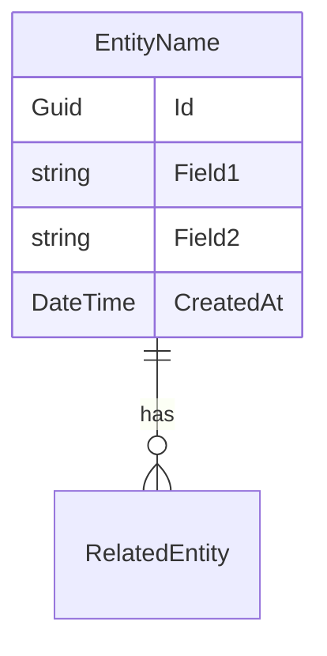

# 📝 Feature: <Tên tính năng> (FEAT-XXX)

## 1. Business Context
- Mục tiêu nghiệp vụ của tính năng này là gì?  
- Ai sử dụng (persona: Trader, Admin, Integration Service)?  
- Giá trị mang lại (ví dụ: giảm thời gian thao tác, tăng tốc độ khớp lệnh)?  

---

## 2. Requirements
### Functional
- Các API/command cần hỗ trợ.  
- Business rule (điều kiện, validation).  
- Event cần publish/consume.  

### Non-functional
- Performance (latency, throughput).  
- Security (AuthN/AuthZ, input validation).  
- Reliability (retry, idempotency).  

---

## 3. API Contract
### Endpoint chính
```http
<HTTP METHOD> /api/v1/<resource>
Headers: ...
Body: ...
→ Response: ...
```
### Error cases
- 400 Validation error → { "error": "...", "traceId": "..." }
- 401 Unauthorized
- 409 Conflict (nếu resource state không hợp lệ)

## 4. Flow Diagram
```mermaid
sequenceDiagram
  Actor->>API: Action
  API->>Service: Command/Query
  Service->>DB: Persist/Read
  Service->>Broker: Publish Event
  API-->>Actor: Response
```
## 5. Data Model

- Entity chính:
- Quan hệ với bảng khác (User, Order, etc.)
- Mapping sang Orleans Grain (nếu có).
- Cache key pattern trong Redis (nếu có).
## 6. Dependencies
- Service nào cần gọi (ví dụ: Auth, Pricing, Settlement)?
- RabbitMQ exchange/queue nào?
- Redis key nào liên quan?
## 7. ADR / Runbook liên quan
- ADR: 0003-outbox-pattern.md
- Runbook: api-down.md
## 8. Testing Notes
- Unit test case nào bắt buộc?
- Integration test flow?
- Performance benchmark cần đạt?
## 9. Open Questions
- Còn điểm nào chưa rõ?
- Ai là người approve nghiệp vụ/kiến trúc?
## 10. Status
```
Draft | In Progress | Implemented | Deprecated
```

📌 **Ưu điểm**:  
- Giúp tất cả feature docs **đồng nhất cấu trúc**.  
- Dev mới chỉ cần đọc 1 file template là biết phải điền gì.  
- Tự động link sang ADR + Runbook để trace.  

