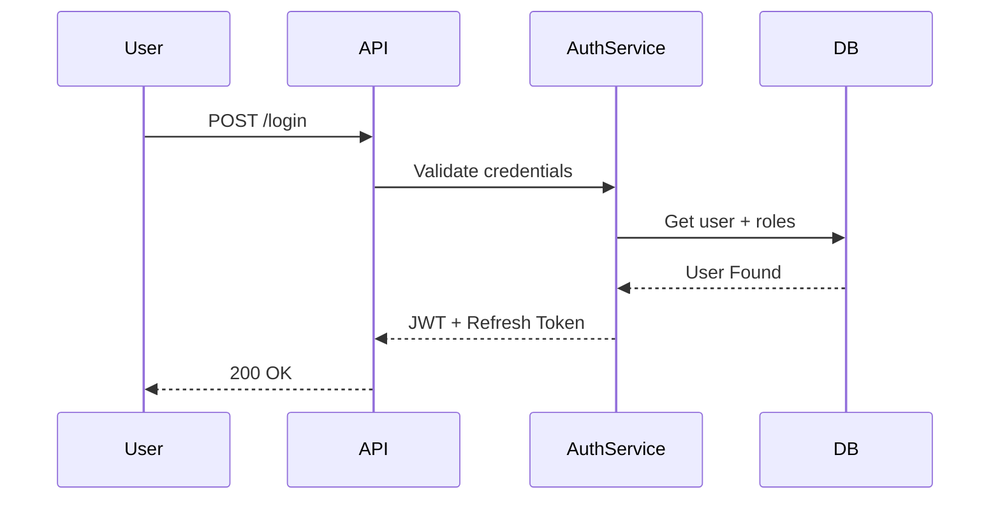
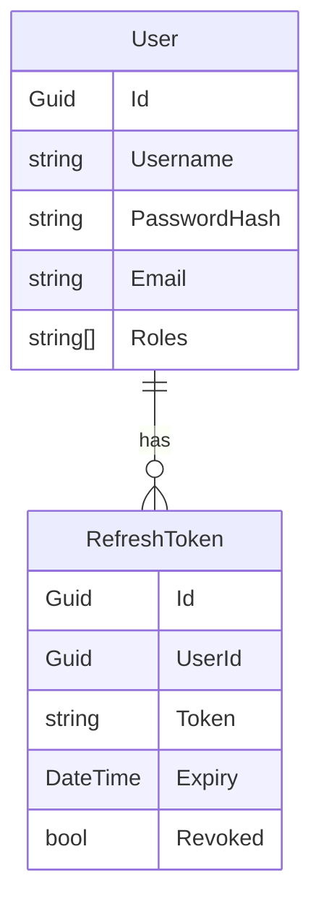

# 🔑 Feature: Authentication (FEAT-001)

## Business Context
Người dùng (Trader/Admin) cần đăng nhập để sử dụng API.  
Yêu cầu bảo mật cao: JWT + Refresh Token rotation.

## Requirements
- Login bằng username/password.
- Access token TTL 15 phút.
- Refresh token TTL 7 ngày, rotate mỗi lần dùng.
- Logout → revoke refresh token.
- Roles/Permissions gắn trong JWT claims.

## API Contract
### Login
```http
POST /api/v1/auth/login
{
  "username": "string",
  "password": "string"
}
→ 200 OK
{
  "accessToken": "jwt",
  "refreshToken": "guid"
}
```
### Refresh
```http
POST /api/v1/auth/refresh
{
  "refreshToken": "guid"
}
→ 200 OK { "accessToken": "jwt", "refreshToken": "guid" }

```
### Logout
``` http
POST /api/v1/auth/logout
{ "refreshToken": "guid" }
→ 204 No Content
```
## Flow Diagram

## Data Model
