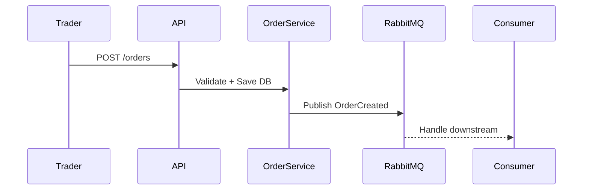

---

## 3. `order-placement.md`
```markdown
# 📦 Feature: Order Placement (FEAT-002)

## Business Context
Trader đặt lệnh (Buy/Sell).  
Quan trọng: tính đúng giá, khớp nhanh, idempotent.

## Requirements
- Đặt lệnh qua API.
- Có `Idempotency-Key` trong header.
- Lệnh lưu vào DB + publish event sang RabbitMQ.
- Orleans Grain giữ state của từng Order.
- Performance: ≤100ms API response.

## API Contract
```http
POST /api/v1/orders
Headers: Idempotency-Key: <guid>
Body:
{
  "symbol": "EUR/USD",
  "side": "BUY",
  "quantity": 100000,
  "price": 1.1000
}
→ 201 Created { "orderId": "guid", "status": "NEW" }
```
## Flow

## Data Model
### Order Table
- Id (GUID, PK)
- Symbol, Side, Quantity, Price
- Status (NEW, FILLED, CANCELED)
- CreatedAt, UpdatedAt